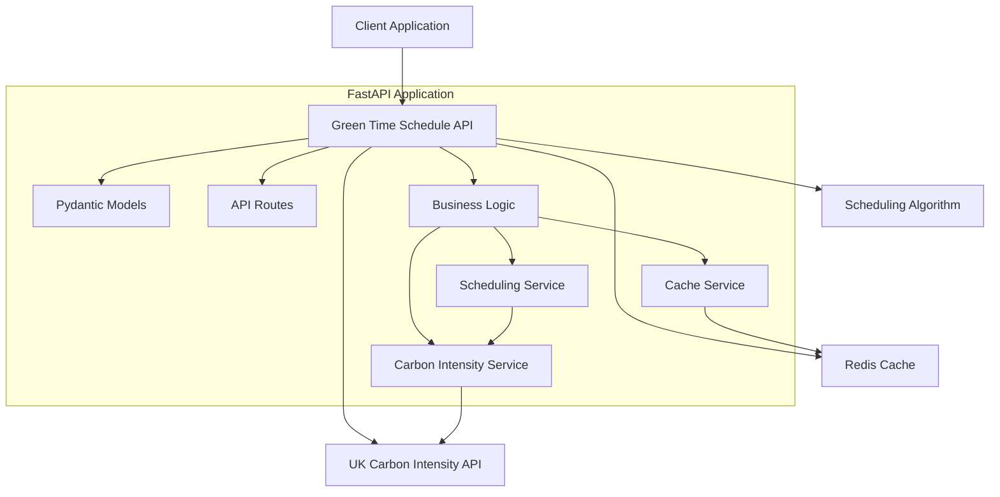
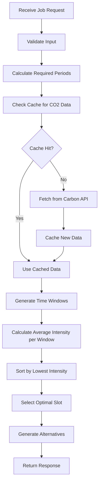

# Green Time Schedule API - Architecture

## System Overview
The API will help users schedule batch jobs during periods of lowest CO2 intensity on the UK electrical grid. It will use FastAPI with temporary caching of CO2 forecast data to optimize performance.

## Core Requirements Summary
- **Framework**: FastAPI
- **External API**: UK Carbon Intensity API
- **Timezone**: UK (UTC/GMT) 
- **Granularity**: 30-minute periods (matching Carbon Intensity API)
- **Functionality**: Return optimal time slots only (stateless scheduling)
- **Caching**: Temporary CO2 forecast data caching
- **Input**: Job duration + deadline
- **Output**: Optimal start time for lowest CO2 impact

## System Architecture



## API Endpoints Design

### 1. Schedule Job Endpoint
```
POST /api/v1/schedule-job
```

**Request Model:**
```json
{
  "job_duration_minutes": 120,
  "deadline_utc": "2024-06-20T18:00:00Z",
  "job_name": "data-processing-batch", // optional
  "priority": "low" // optional: low, medium, high
}
```

**Response Model:**
```json
{
  "optimal_start_time": "2024-06-20T14:30:00Z",
  "optimal_end_time": "2024-06-20T16:30:00Z",
  "carbon_intensity": 156,
  "carbon_index": "low",
  "alternative_slots": [
    {
      "start_time": "2024-06-20T15:00:00Z",
      "end_time": "2024-06-20T17:00:00Z",
      "carbon_intensity": 168,
      "carbon_index": "low"
    }
  ],
  "scheduling_metadata": {
    "periods_analyzed": 24,
    "forecast_confidence": "high",
    "cached_data_age_minutes": 15
  }
}
```

### 2. Carbon Forecast Endpoint
```
GET /api/v1/carbon-forecast?date={date}&hours={hours}
```

**Response Model:**
```json
{
  "date": "2024-06-20",
  "forecast_periods": [
    {
      "period": 1,
      "start_time": "2024-06-20T00:00:00Z",
      "end_time": "2024-06-20T00:30:00Z",
      "intensity_forecast": 234,
      "intensity_index": "moderate"
    }
  ],
  "data_freshness": "2024-06-20T13:45:00Z"
}
```

### 3. Health Check Endpoint
```
GET /api/v1/health
```

## Data Models

```python
from pydantic import BaseModel, Field
from datetime import datetime
from typing import Optional, List
from enum import Enum

class Priority(str, Enum):
    LOW = "low"
    MEDIUM = "medium" 
    HIGH = "high"

class CarbonIndex(str, Enum):
    VERY_LOW = "very low"
    LOW = "low"
    MODERATE = "moderate"
    HIGH = "high"
    VERY_HIGH = "very high"

class JobScheduleRequest(BaseModel):
    job_duration_minutes: int = Field(ge=30, le=1440)  # 30 min to 24 hours
    deadline_utc: datetime
    job_name: Optional[str] = None
    priority: Priority = Priority.LOW

class TimeSlot(BaseModel):
    start_time: datetime
    end_time: datetime
    carbon_intensity: int
    carbon_index: CarbonIndex

class SchedulingMetadata(BaseModel):
    periods_analyzed: int
    forecast_confidence: str
    cached_data_age_minutes: int

class JobScheduleResponse(BaseModel):
    optimal_start_time: datetime
    optimal_end_time: datetime
    carbon_intensity: int
    carbon_index: CarbonIndex
    alternative_slots: List[TimeSlot]
    scheduling_metadata: SchedulingMetadata
```

## Scheduling Algorithm Flow



## Caching Strategy

**Cache Key Structure:**
```
carbon_forecast:{date}:{period_range}
```

**Cache Configuration:**
- **TTL**: 30 minutes (matches Carbon Intensity API update frequency)
- **Storage**: Redis for production, in-memory for development
- **Invalidation**: Time-based expiry + manual refresh endpoint

## Error Handling Strategy

```python
class GreenScheduleException(Exception):
    pass

class CarbonAPIUnavailableError(GreenScheduleException):
    pass

class InvalidScheduleRequestError(GreenScheduleException):
    pass

class NoViableTimeSlotError(GreenScheduleException):
    pass
```

## Project Structure

```
greentimeschedule/
├── app/
│   ├── __init__.py
│   ├── main.py                 # FastAPI app initialization
│   ├── config.py              # Configuration settings
│   ├── models/
│   │   ├── __init__.py
│   │   ├── requests.py        # Request models
│   │   ├── responses.py       # Response models
│   │   └── carbon.py          # Carbon intensity models
│   ├── services/
│   │   ├── __init__.py
│   │   ├── carbon_service.py  # Carbon Intensity API integration
│   │   ├── cache_service.py   # Caching logic
│   │   └── schedule_service.py # Scheduling algorithms
│   ├── routes/
│   │   ├── __init__.py
│   │   ├── schedule.py        # Scheduling endpoints
│   │   ├── carbon.py          # Carbon forecast endpoints
│   │   └── health.py          # Health check endpoints
│   └── utils/
│       ├── __init__.py
│       ├── time_utils.py      # Time/date utilities
│       └── exceptions.py      # Custom exceptions
├── tests/
│   ├── __init__.py
│   ├── test_schedule_service.py
│   ├── test_carbon_service.py
│   └── test_endpoints.py
├── requirements.txt
├── pyproject.toml
├── README.md
└── docker-compose.yml         # For Redis cache
```

## Key Features & Benefits

1. **Intelligent Scheduling**: Finds optimal time slots based on CO2 intensity forecasts
2. **Performance Optimized**: Caching reduces external API calls by ~90%
3. **Flexible Duration**: Supports jobs from 30 minutes to 24 hours
4. **Alternative Options**: Provides backup time slots if primary isn't suitable
5. **Comprehensive Metadata**: Returns confidence levels and data freshness info
6. **Robust Error Handling**: Graceful degradation when external services are unavailable

## Implementation Phases

**Phase 1**: Core API structure with basic scheduling  
**Phase 2**: Advanced caching and optimization  
**Phase 3**: Enhanced error handling and monitoring  
**Phase 4**: Performance testing and documentation